# RACECAR: (Raceca)r (R)enderer

Team 6
- Charles Wang, Anthony Ge, Saahil Gupta, Aaron Jiang
- [Original pitch document](https://docs.google.com/document/d/1j6_ybNivTQ-5yWpir-YyTrfw25QPabRPDMYnZbbpDFE)
- [Milestone 1 presentation](https://docs.google.com/presentation/d/12kjNLzn8d41ME9kHvzYVEgyTugg4P2bqzO_xdeyU1to)
- [Milestone 2 presentation](https://docs.google.com/presentation/d/1SAvpTj8gU0uzmK-C_Fmakty60CFiGGIhXUBPoFP1-iw)
- [Milestone 3 presentation](https://docs.google.com/presentation/d/15Yk6nuF8lukJmDto_tTPZz7DENXsyRABhGUGP3UAO0Y)

RACECAR is a Vulkan renderer written in C++. It's inspired by racing games like the _Forza_ and _Gran Turismo_ series. We aim to implement state-of-the-art material, environment, and sky rendering based on recent papers and graphics techniques.

## Material Rendering

Features shown: clearcoat color, glints, PBR microfacet model, IBL reflection. Skies, irradiance, and rough glossy mips are encoded as an octahedral map for reflections.

### Glints

</img>

Anisotropic pixel-footprint glints using Deliot's 2023 method, used to replace the NDF for direct lighting evaluation.

## Sky and atmosphere

Our sky is based on the [2017 implementation](https://ebruneton.github.io/precomputed_atmospheric_scattering) of [Eric Bruneton's 2008 paper](https://inria.hal.science/inria-00288758/en) on precomputed atmospheric scattering. In essence, by solving for Earth's atmospheric parameters, we can precompute the irradiance, transmittance, and scattering coefficients and store the data in a binary format. This data is then loaded as 2D/3D textures at runtime, and we then perform texture look-ups to resolve the sky color for a given viewing angle.

The precomputation step is what allows for real-time rendering of the sky. We measured rendering to take ~0.3 ms on a RTX 4070 Laptop GPU.

|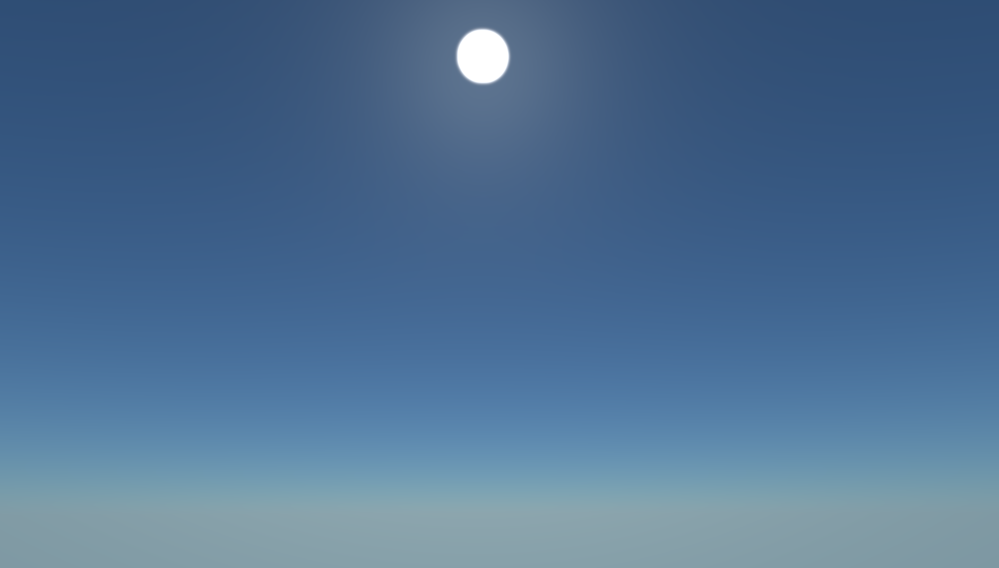|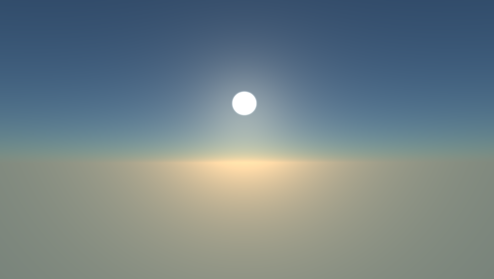|
|:-:|:-:|
|High in the sky|Approaching sunset|
|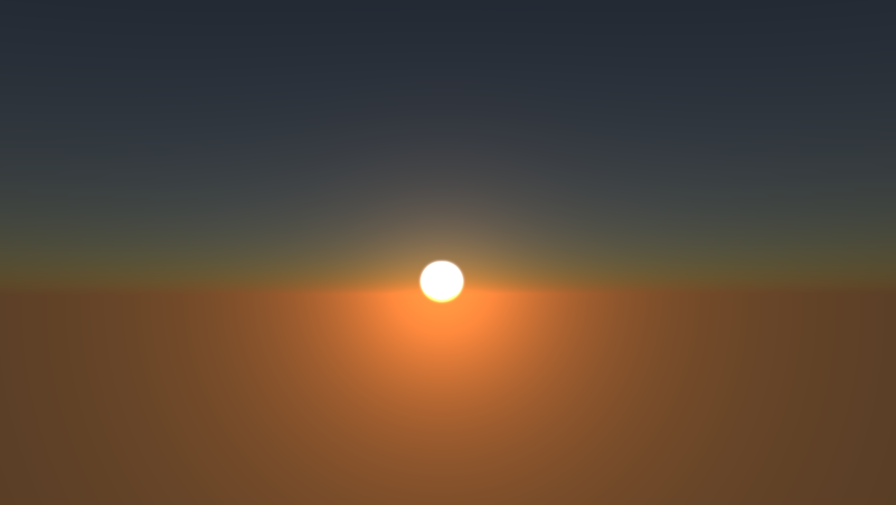|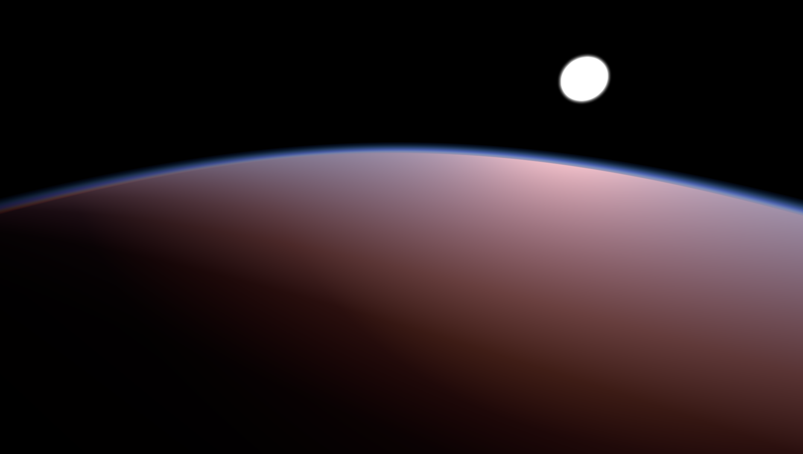|
|Sunset|View from outside Earth's atmosphere|

The sample code in the 2017 codebase could not be used directly for a number of reasons. It performs ray-sphere intersection tests to render a "demo sphere" and ground, it hardcodes shadows and lightshafts for the demo, and it is written with OpenGL + GLSL. None of these were applicable to our project.

- Rewrote the code to use Vulkan and Slang
  - Original code uses +Z as the up axis; we use +Y
  - OpenGL clip space uses +Y for clip space, Vulkan uses -Y
  - Original code uses kilometers as base unit, meaning a camera height of Y=9 translated to being 9 kilometers in Earth's atmosphere! Changed to meters instead.
- Removed ray-sphere intersection tests because we'll be drawing our own terrain later
  - Also interferes with our sky-to-cubemap conversion, which is used for IBL
- Removed hardcoded shadows and lightshafts

## Raytracing
Our renderer features fully raytraced shadows, enabling self-shadowing and realistic lighting.

|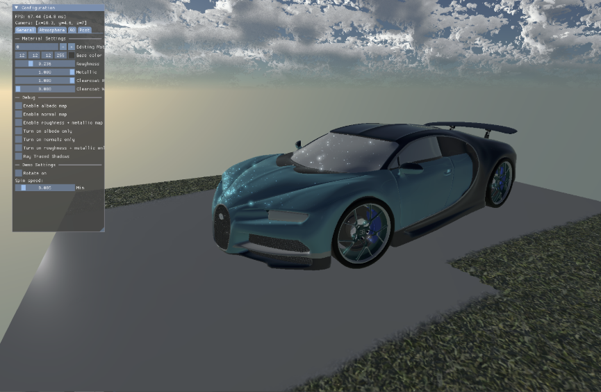|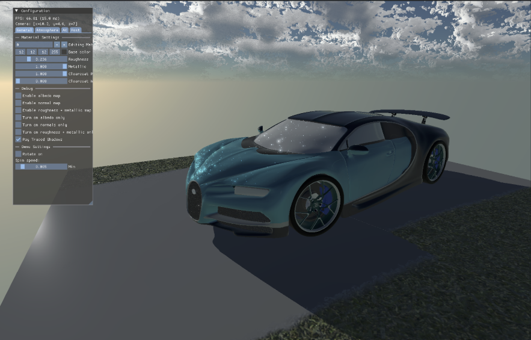|
|:-:|:-:|
|Raytracing off|Raytracing on|
|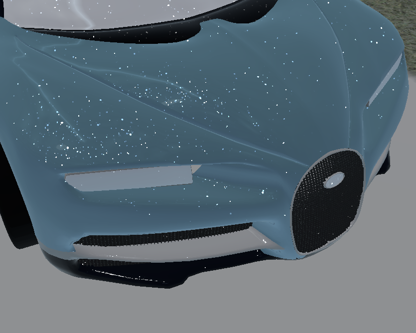|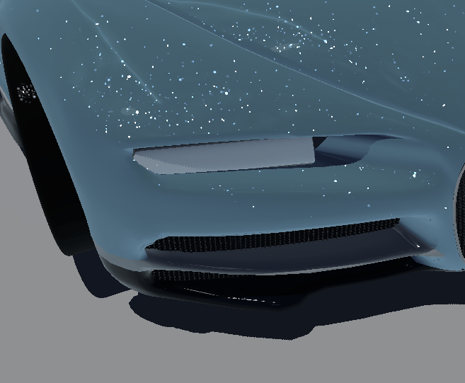|
|Raytracing off|Raytracing on|
## Clouds

The renderer features raymarched clouds based on Gran Turismo’s 2023 sky rendering talk at GDC. It uses 3 layers of noises at different scales - cached into small textures. We account for Beer’s Law and Two Term Henyey-Greenstein for forward and back scattering, and ray origins are jittered to avoid banding artifacts.

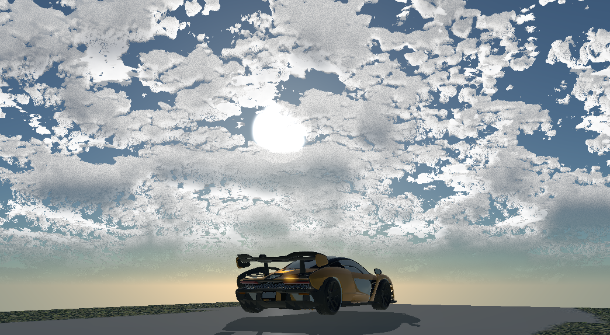

## Terrain
The terrain is rendered via a separate deferred pass, using an artist-authored material-mask to determine which types of materials (snow, grass, etc.) exist at a given world position. We blend materials together seamelessly and use UV distortion to break-up harsh transitions.

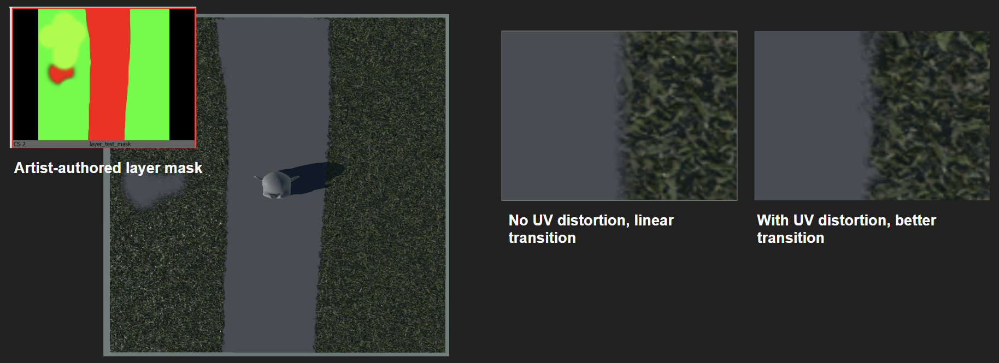

## Post-processing

### Bloom

A bloom post-processing pass is added to the final scene color. Our implementation is compute-based and achieves the pass through multiple compute passes:

1. Filter out scene color based on a brightness threshold
2. Perform 5 iterative Gaussian blur passes
3. Additive blend blurred result with original scene color

These steps can also be seen in the screenshots below.

|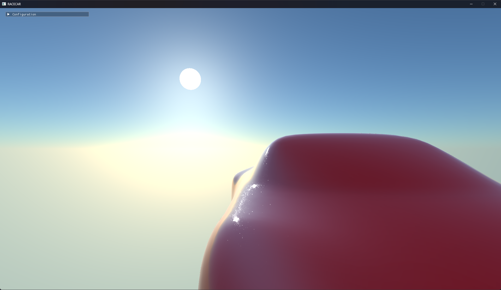|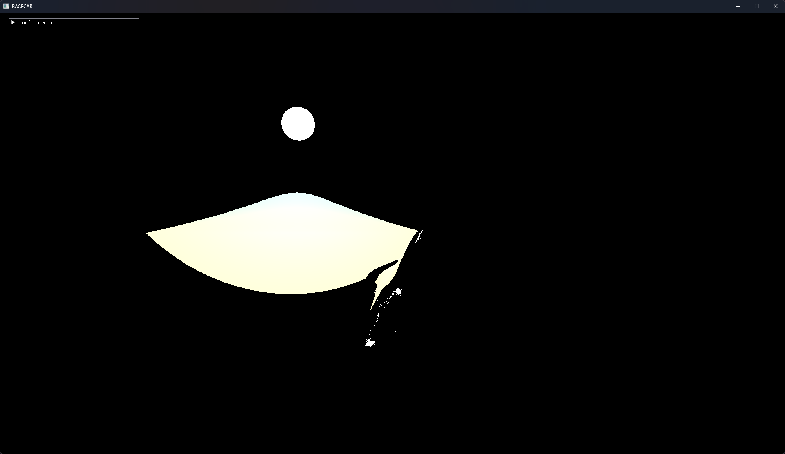|
|:-:|:-:|
|Original final color|Filter out color via luminance threshold|
|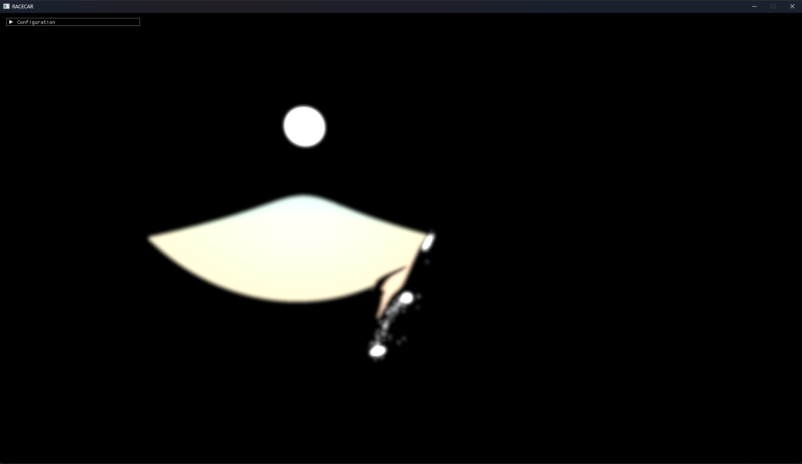|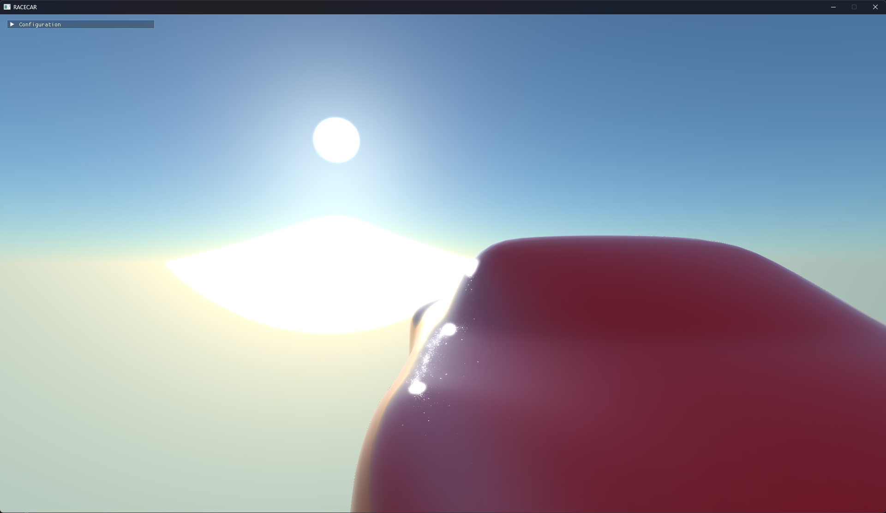|
|5-step blur pass|Additive blending|

Performance is currently 0.4 ms on a RTX 5060 Ti, and 1.3 ms on a RTX 4070 Laptop GPU.

### Tonemapping
We implement [Gran Turismo 7's tonemapping solution](https://blog.selfshadow.com/publications/s2025-shading-course/pdi/s2025_pbs_pdi_slides_v1.1.pdf) presented at SIGGRAPH 2025.

|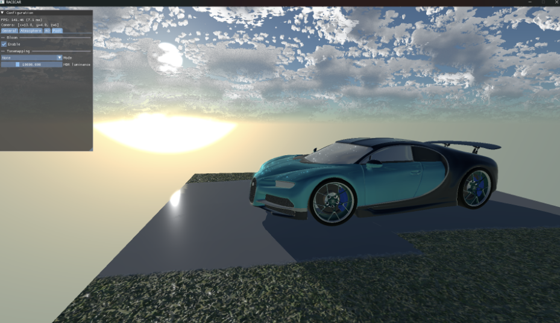|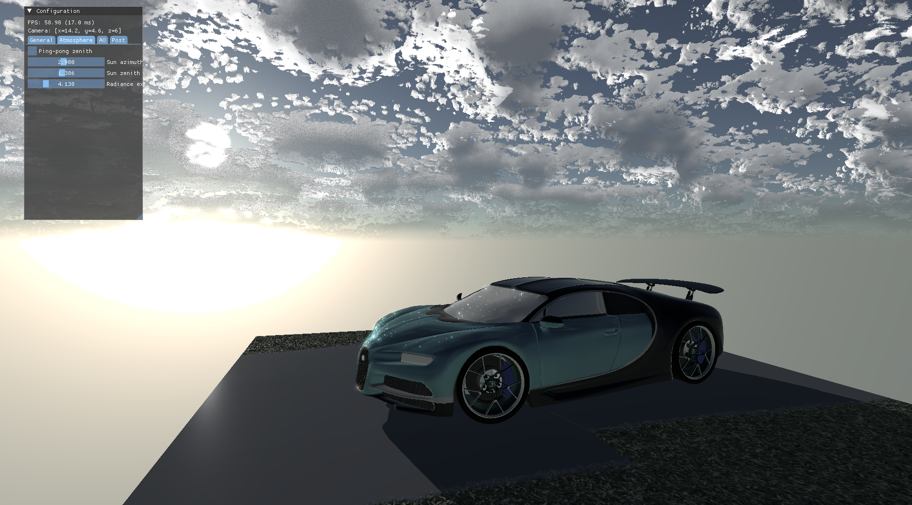|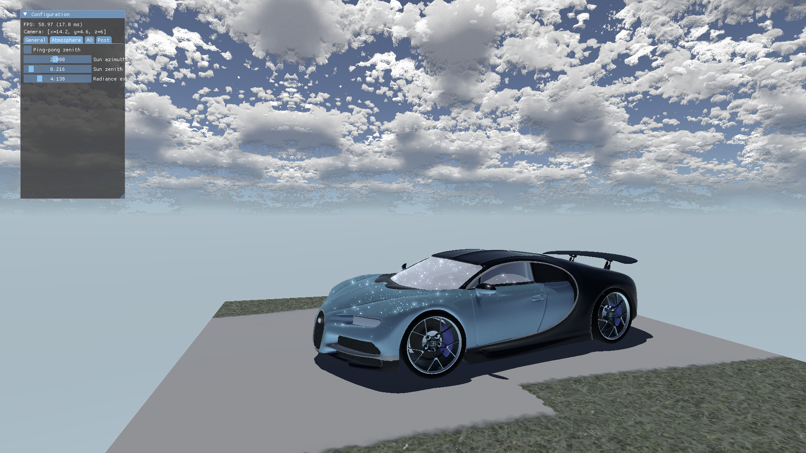
|:-:|:-:|:-:|
|Original|Post-tonemapped|Post-tonemapped

## Development

We use vcpkg for managing third-party C++ libraries, CMake for configuration, clang as the C++ compiler, and Ninja as our build system.

- For more information about vcpkg, see [vcpkg.io](https://vcpkg.io). Here's a tutorial on installing vcpkg with CMake and VS Code: [learn.microsoft.com/en-us/vcpkg/get_started/get-started-vscode](https://learn.microsoft.com/en-us/vcpkg/get_started/get-started-vscode?pivots=shell-powershell).
- Get a CMake version above 4.0 at [cmake.org/download](https://cmake.org/download). Multiple CMake presets are available, targeting either debug or release builds.
- Get the latest available LLVM release at [github.com/llvm/llvm-project/releases](https://github.com/llvm/llvm-project/releases) (for the clang compiler and other tools). If using clangd, make sure you have version 21 or above.
- Get the latest Ninja binary at [github.com/ninja-build/ninja/releases](https://github.com/ninja-build/ninja/releases). Make sure it's available on your PATH.

### Vulkan SDK

#### Windows

Make sure your GPU supports Vulkan 1.4 and your drivers are up to date. Get the [Vulkan SDK](https://vulkan.lunarg.com/) and run the installer with admin privileges so it can set the appropriate environment variables for you.

To check that Vulkan is ready for use, go to your Vulkan SDK directory (by default should be `C:/VulkanSDK`) and run the `vkcube.exe` example within the `Bin` directory. If you see a rotating gray cube with the LunarG logo, then you are all set!

#### macOS

On Macs, developing for Vulkan is a bit more complicated. There is no direct Vulkan support; instead, [MoltenVK](https://github.com/KhronosGroup/MoltenVK) (which comes with the macOS Vulkan SDK) translates a subset of the Vulkan API into Metal.

macOS uses MoltenVK as the ICD, which sits between RACECAR and the actual Apple GPU drivers. Usually you would bundle `libvulkan.1.dylib`/`libMoltenVK.dylib` into your .app, but RACECAR is not being built like that. Unfortunately for us, by default SDL3 tries to find these libraries relative to the RACECAR binary, which... won't work.

This is why we have to explicitly call `SDL_Vulkan_LoadLibrary` in [sdl.cpp](src/sdl.cpp) with a hardcoded file path to the Vulkan dynamic library, because we can't rely on default behavior. For the developer this means two things:

- Install Vulkan SDK 1.4.328.0 or higher, which is the first version that includes MoltenVK 1.4 (aka Vulkan 1.4 support).
- Making the Vulkan SDK available globally on your system, meaning in `/usr/local`. This should have been an option during SDK setup, but the SDK also provides a `install_vulkan.py` script that does this post-installation.
