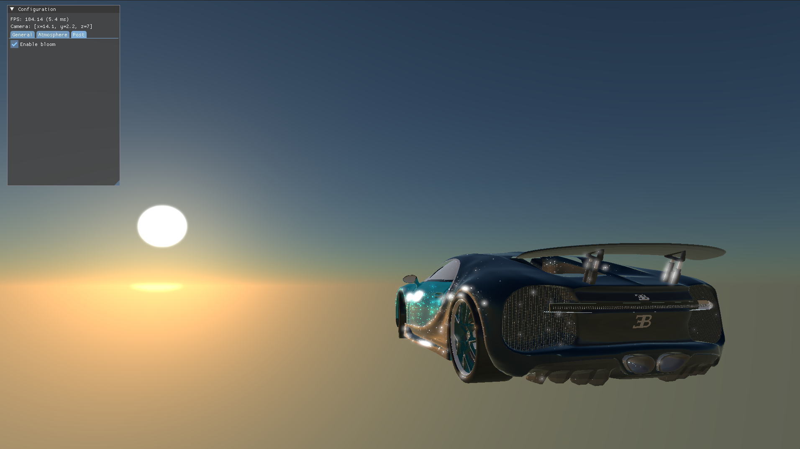
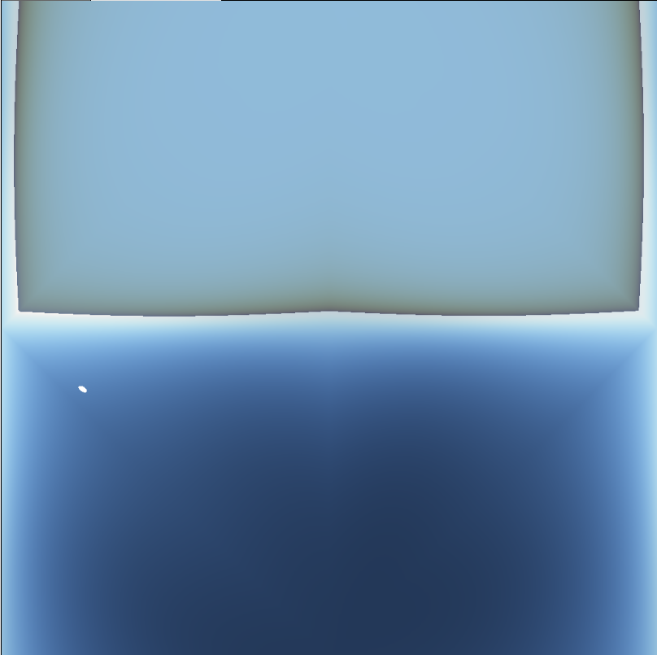

# RACECAR: (Raceca)r (R)enderer

- Team 6: Charles Wang, Anthony Ge, Saahil Gupta, Aaron Jiang
- Pitch document: [docs.google.com/document/d/1j6_ybNivTQ-5yWpir-YyTrfw25QPabRPDMYnZbbpDFE](https://docs.google.com/document/d/1j6_ybNivTQ-5yWpir-YyTrfw25QPabRPDMYnZbbpDFE)

## Material Rendering

Features shown: clearcoat color, glints, PBR microfacet model, IBL reflection. Skies are encoded as an octahedral map for reflections.

</img>
 

---
### Glints

</img>

Anisotropic pixel-footprint glints using Deliot's 2023 method, used to replace the NDF for direct lighting evaluation.

## Development

We use vcpkg for managing third-party C++ libraries, CMake for configuration, clang as the C++ compiler, and Ninja as our build system.

- For more information about vcpkg, see [vcpkg.io](https://vcpkg.io). Here's a tutorial on installing vcpkg with CMake and VS Code: [learn.microsoft.com/en-us/vcpkg/get_started/get-started-vscode](https://learn.microsoft.com/en-us/vcpkg/get_started/get-started-vscode?pivots=shell-powershell).
- Get a CMake version above 4.0 at [cmake.org/download](https://cmake.org/download). Multiple CMake presets are available, targeting either debug or release builds.
- Get the latest available LLVM release at [github.com/llvm/llvm-project/releases](https://github.com/llvm/llvm-project/releases) (for the clang compiler and other tools). If using clangd, make sure you have version 21 or above.
- Get the latest Ninja binary at [github.com/ninja-build/ninja/releases](https://github.com/ninja-build/ninja/releases). Make sure it's available on your PATH.

### Vulkan SDK

Make sure your GPU supports Vulkan and your drivers are up to date. Get the [Vulkan SDK](https://vulkan.lunarg.com/) and run the installer with admin privileges so it can set the appropriate environment variables for you.

To check that Vulkan is ready for use, go to your Vulkan SDK directory (on Windows it's `C:/VulkanSDK/` unless otherwise specified) and run the `vkcube.exe` example within the `Bin` directory. If you see a rotating gray cube with the LunarG logo, then you are all set!
